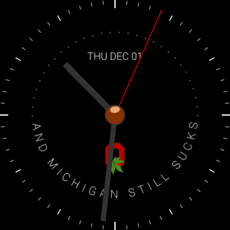
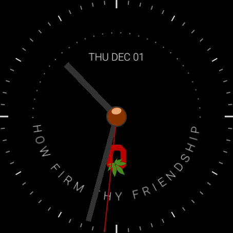

# Time Change

Watch faces for Wear OS using the [Watch Face Format](https://developer.android.com/training/wearables/wff).

Requires Wear OS 4+.

## Screenshots

| Digital | Analog Michigan | Analog Carmen | Block O |
|:-------:|:---------------:|:-------------:|:-------:|
|  |  |  |  |

## Build & Install

```sh
./gradlew :watchface:assembleDebug
adb install watchface/build/outputs/apk/debug/watchface-debug.apk
```

## Resources

- [Watch Face Format overview](https://developer.android.com/training/wearables/wff)
- [XML schema reference](https://developer.android.com/training/wearables/wff/watch-face)
- [Sample watch faces](https://github.com/android/wear-os-samples/tree/main/WatchFaceFormat)

## License

MIT
